[](https://travis-ci.org/IBM/watson-discovery-food-reviews)

# Discover customer sentiment from product reviews

In this code pattern, we walk you through a working example of a web application that queries and manipulates data from the Watson Discovery Service. With the aid of a custom model built with Watson Knowledge studio, the data will have additional enrichments that will provide improved insights for user analysis.

This web app contains multiple UI components that you can use as a starting point for developing your own Watson Discovery and Knowledge Studio service applications. 

The main benefit of using the Watson Discovery Service is its powerful analytics engine that provides cognitive enrichments and insights into your data. This app provides examples of how to showcase these enrichments through the use of filters, lists and graphs. The key enrichments that we will focus on are:

* **Entities**: people, companies, organizations, cities, and more.
* **Categories**: classification of the data into a hierarchy of categories up to 5 levels deep.
* **Concepts**: identified general concepts that aren't necessarily referenced in the data.
* **Keywords**: important topics typically used to index or search the data.
* **Entity Types**: the classification of the discovered entities, such as person, location, or job title.
* **Sentiment**: the overall positive or negative sentiment of each document.

With Watson Knowledge Studio, a machine learning annotator can be trained to recognize mentions of custom entity and relation types which can then be incorporated into the Discovery application enrichment process.

> For this code pattern, we will be using data that contains food reviews from Amazon, see the [Kaggle dataset](https://www.kaggle.com/snap/amazon-fine-food-reviews) for further information.

When the reader has completed this code pattern, they will understand how to:

* Use Watson Knowledge Studio to create a custom annotator.
* Deploy a Watson Knowledge Studio model to Watson Discovery.
* Load and enrich data in the Watson Discovery Service.
* Query and manipulate data in the Watson Discovery Service.
* Create UI components to represent enriched data created by the Watson Discovery Service.
* Build a complete web app that utilizes popular JavaScript technologies to feature Watson Discovery Service data and enrichments.

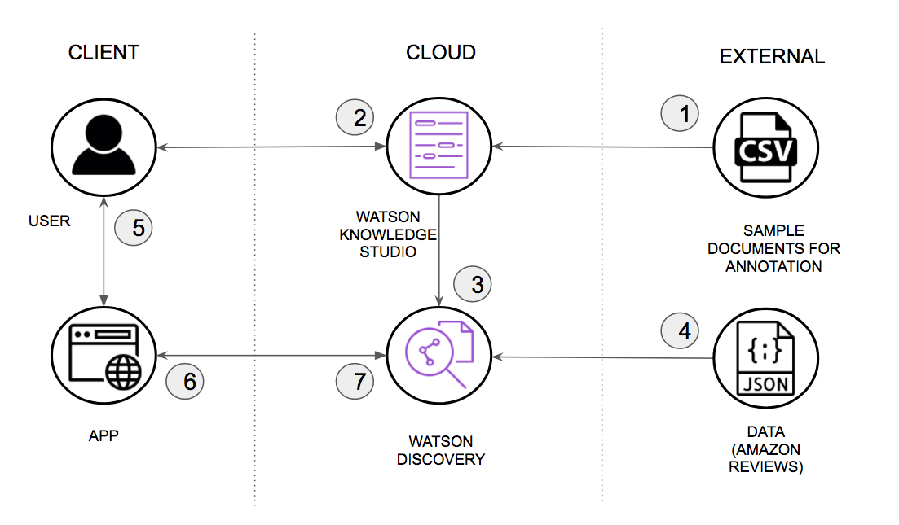

## Flow

1. A sample set of review documents are loaded into Watson Knowledge Studio for annotation.
1. A Watson Knowledge Studio model is created.
1. The Watson Knowledge Studio model is applied to a Watson Discovery service instance.
1. The food review json files are added to the Discovery collection.
1. The user interacts with the backend server via the app UI. The frontend app UI uses React to render search results and can reuse all of the views that are used by the backend for server side rendering. The frontend is using semantic-ui-react components and is responsive.
1. User input is processed and routed to the backend server, which is responsible for server side rendering of the views to be displayed on the browser. The backend server is written using express and uses express-react-views engine to render views written using React.
1. The backend server sends user requests to the Watson Discovery Service. It acts as a proxy server, forwarding queries from the frontend to the Watson Discovery Service API while keeping sensitive API keys concealed from the user.

> NOTE: see [DEVELOPING.md](DEVELOPING.md) for project structure.

## Included components

* [Watson Discovery](https://www.ibm.com/watson/services/discovery/): A cognitive search and content analytics engine for applications to identify patterns, trends, and actionable insights.
* [Watson Knowledge Studio](https://www.ibm.com/watson/services/knowledge-studio/): Teach Watson the language of your domain with custom models that identify entities and relationships unique to your industry, in unstructured text. Use the models in Watson Discovery, Watson Natural Language Understanding, and Watson Explorer.

## Featured technologies

* [Node.js](https://nodejs.org/): An open-source JavaScript run-time environment for executing server-side JavaScript code.
* [React](https://reactjs.org/): A JavaScript library for building User Interfaces.
* [Express](https://expressjs.com): A popular and minimalistic web framework for creating an API and Web server.
* [Semantic UI React](https://react.semantic-ui.com/introduction): React integration of Semantic UI components. 
* [Chart.js](https://www.chartjs.org/): JavaScript charting package.
* [Jest](https://jestjs.io/): A JavaScript test framework.

# Watch the Video

[](https://youtu.be/gzlUSyLccSg)

# Steps

1. [Clone the repo](#1-clone-the-repo)
1. [Create IBM Cloud services](#2-create-ibm-cloud-services)
1. [Create a Watson Knowledge Studio workspace](#3-create-a-watson-knowledge-studio-workspace)
1. [Upload Type System](#4-upload-type-system)
1. [Import Corpus Documents](#5-import-corpus-documents)
1. [Create the model](#6-create-the-model)
1. [Deploy the machine learning model to Watson Discovery](#7-deploy-the-machine-learning-model-to-watson-discovery)
1. [Create Discovery Collection](#8-create-discovery-collection)
1. [Deploy the application](#9-deploy-the-application)

## 1. Clone the repo

```bash
git clone https://github.com/IBM/watson-discovery-food-reviews
```

## 2. Create IBM Cloud services

Create the following services:

* [**Watson Discovery**](https://cloud.ibm.com/catalog/services/discovery)
* [**Watson Knowledge Studio**](https://cloud.ibm.com/catalog/services/knowledge-studio)

## 3. Create a Watson Knowledge Studio workspace

Launch the **Watson Knowledge Studio** tool and click on **Create entities and relations workspace**.

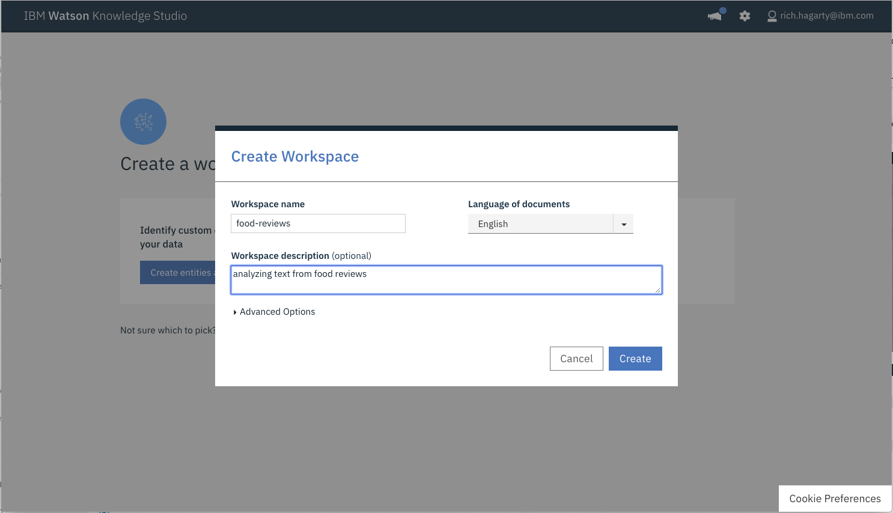

Enter a unique name and press **Create**.

## 4. Upload Type System

A type system allows us to define things that are specific to review documents, such as product and brand names. The type system controls how content can be annotated by defining the types of entities that can be labeled and how relationships among different entities can be labeled.

To upload our pre-defined type system, from the **Assets** -> **Entity Types** panel, press the **Upload** button to import the Type System file [data/types-2aa46ad0-31da-11e8-89a9-efc0f3b77492.json](data/types-2aa46ad0-31da-11e8-89a9-efc0f3b77492.json) found in the local repository.


Press the **Upload** button. This will upload a set of Entity Types and Relation Types:

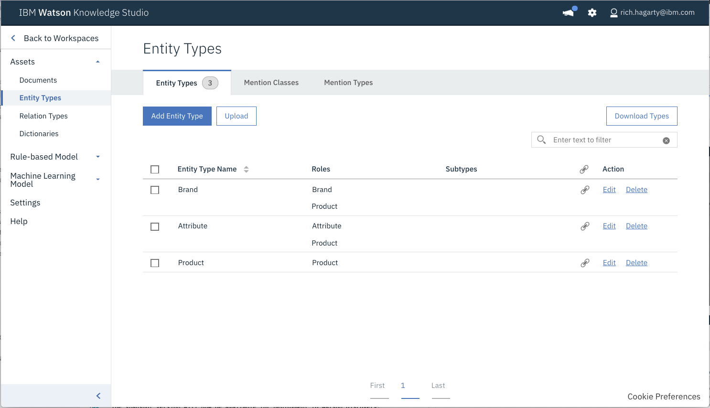

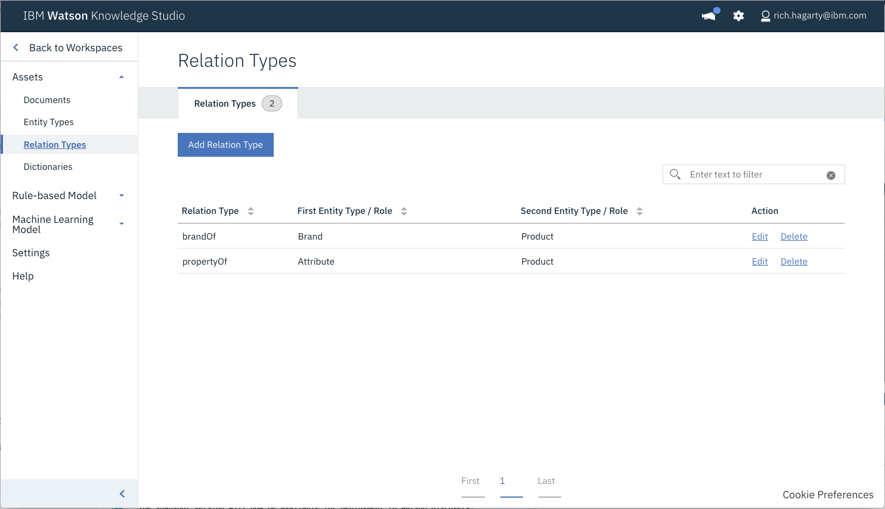

## 5. Import Corpus Documents

Corpus documents are required to train our machine-learning annotator component. For this code pattern, the corpus documents will contain sample review documents.

From the **Assets** -> **Documents** panel, press the **Upload Document Sets** button to import a Document Set file. Use the corpus documents file [data/watson-discovery-food-reviews/data/corpus-2aa46ad0-31da-11e8-89a9-efc0f3b77492.zip](data/watson-discovery-food-reviews/data/corpus-2aa46ad0-31da-11e8-89a9-efc0f3b77492.zip) found in the local repository.

> NOTE: Select the option to "upload corpus documents and include ground truth (upload the original workspace's type system first)"

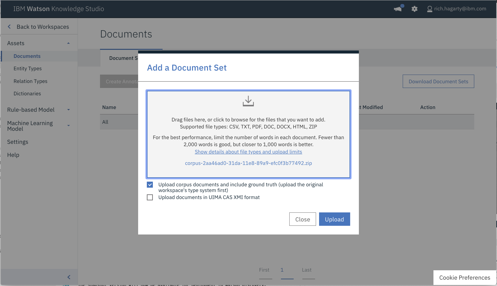

Once uploaded, you should see a set of documents:

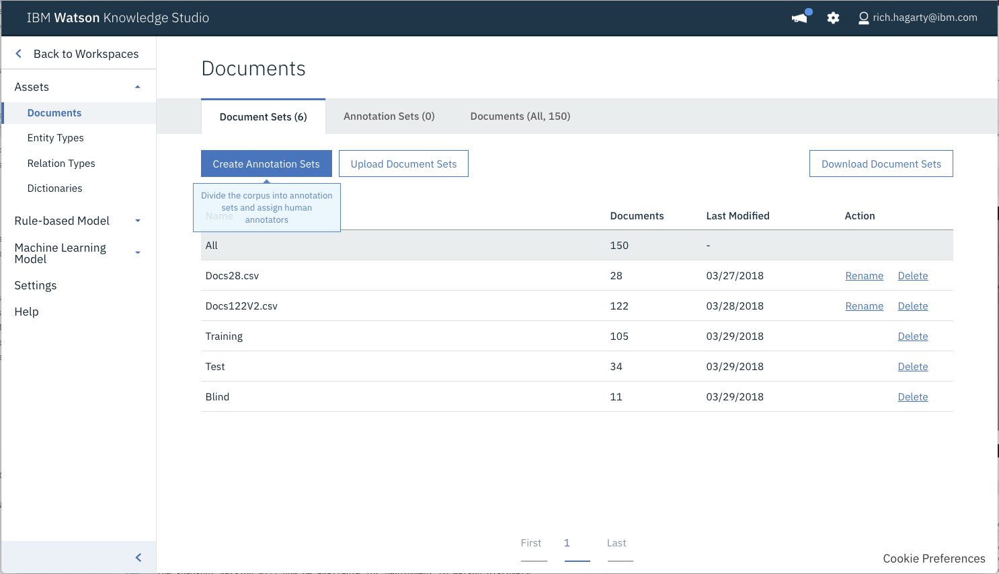

## 6. Create the model

Since the corpus documents that were uploaded were already pre-annotated and included ground truth, it is possible to build the machine learning annotator directly without the need for performing human annotations.

Go to the **Machine Learning Model** -> **Performance** panel, and press the **Train and Evaluate** button.

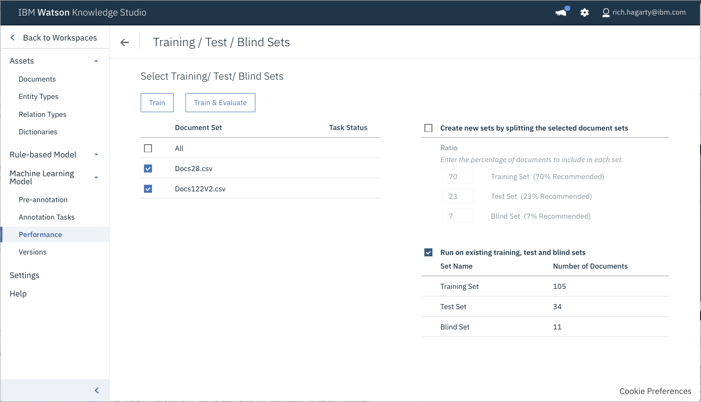

From the **Document Set** name list, select the annotation sets **Docs28.csv** and **Docs122V2.csv**. Also, make sure that the option **Run on existing training, test and blind sets** is checked.  Press the **Train & Evaluate** button.

This process may take several minutes to complete. Progress will be shown in the upper right corner of the panel.

You can view the log files of the process by clicking the **View Log** button.

Once complete, you will see the results of the train and evaluate process:

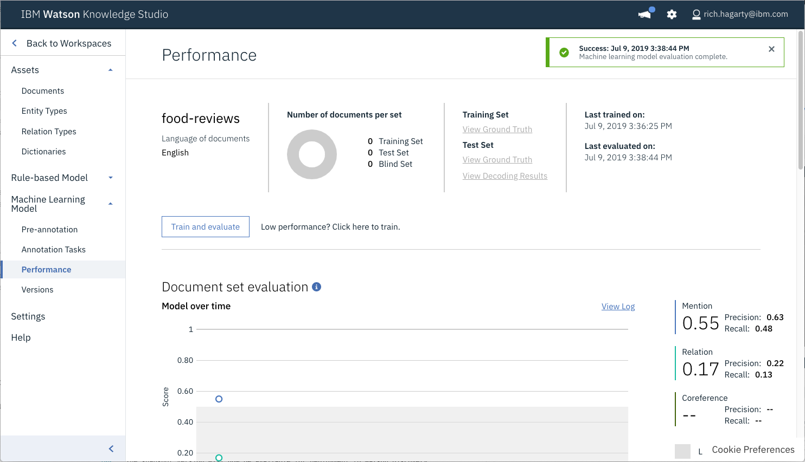

## 7. Deploy the machine learning model to Watson Discovery

Now we can deploy our new model to the already created **Watson Discovery** service. Navigate to the **Versions** menu on the left and press **Create Version**.

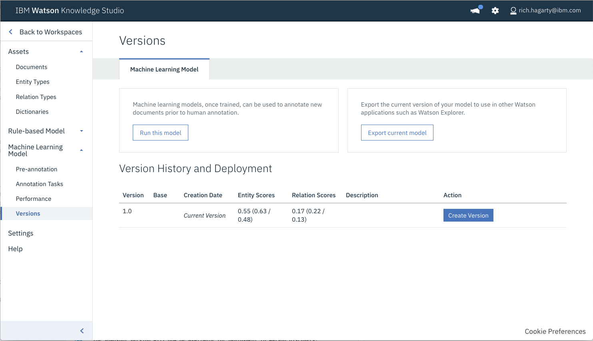

The new version will now be available for deployment to Watson Discovery.

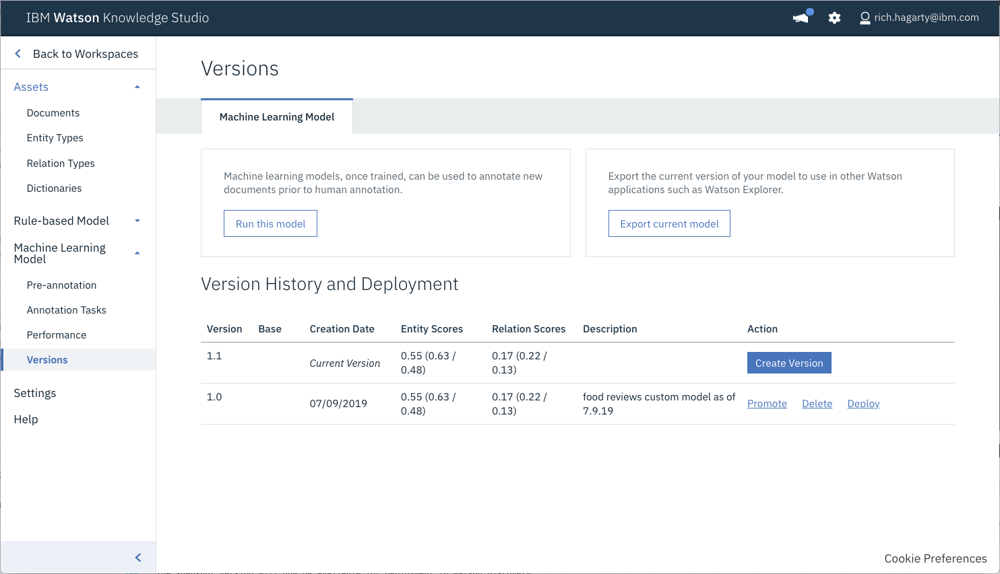

To start the process, click the **Deploy** button associated with your version.

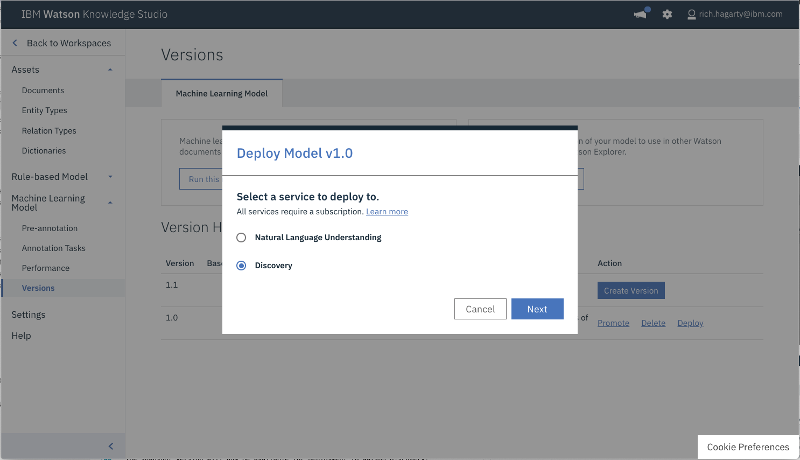

Select the option to deploy to **Discovery**.

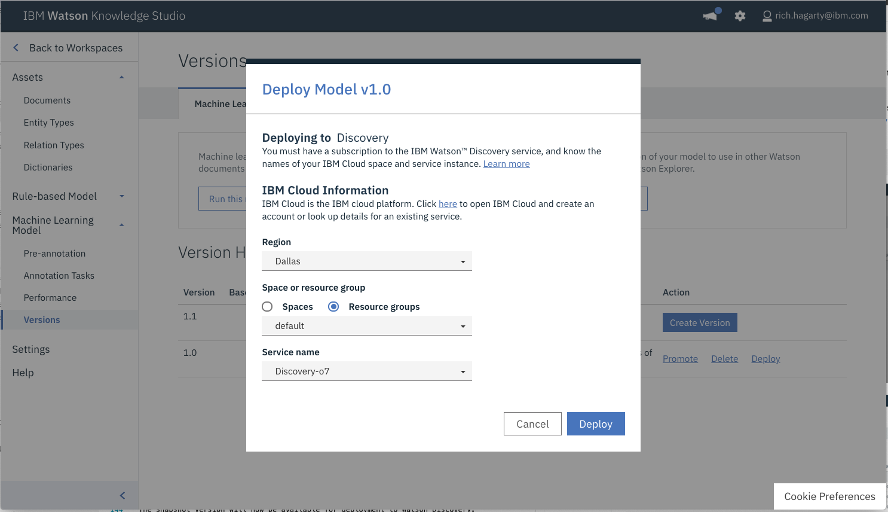

Enter your IBM Cloud account information to locate your **Discovery** service to deploy to.

Once deployed, a **Model ID** will be created. Keep note of this value as it will be required later when configuring your credentials.

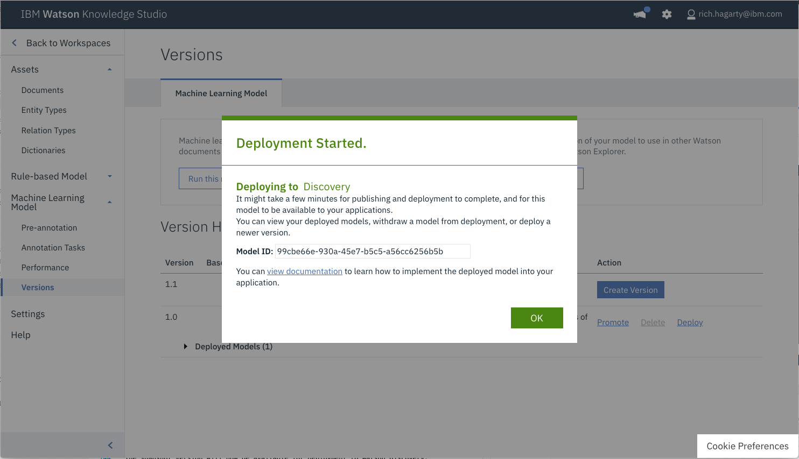

> NOTE: You can also view this **Model ID** by clicking the **Deployed Models** link under the model version.

## 8. Create Discovery Collection

Launch the **Watson Discovery** tool. Create a new data collection by clicking the **Upload you own data** button. Enter a unique name to create your collection.

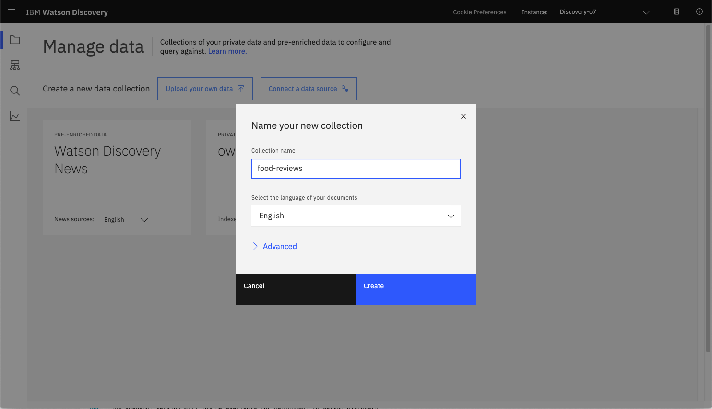

Creating the **Discovery Collection** and populating the .env file with the appropriate credentials is all that is required to deploy and run the app. Once started, the app will load all of the data files into your collection. For details on how to do this manually, go to the [Discovery collection configuration details](#discovery-collection-configuration-details) section below.

To locate your `environment_id` and `collection_id` values for your collection, click the drop-down button at the top of your collection panel.

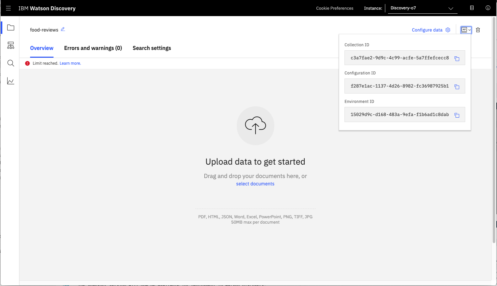

To locate the service credentials for your discovery service, click on the **Service Credentials** tab.

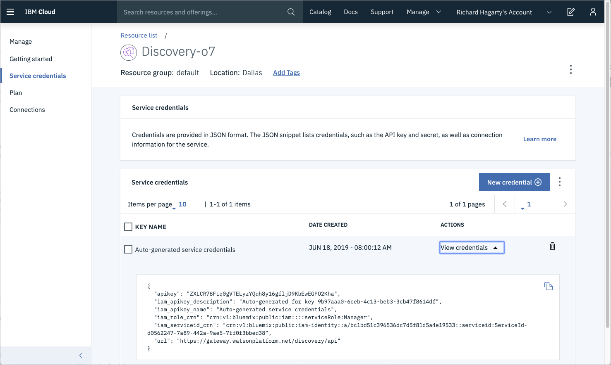

## 9. Deploy the application

There are several ways to deploy the app. Each requires that you provide the necessary credentials for both your Watson Discovery and Watson Knowledge Studio services (see above for how to retrieve the credentials).

Click on one of the options below for instructions on deploying the app.

|   |   |   |
| - | - | - |
| [](doc/source/openshift.md) | [](doc/source/cf.md) | [](doc/source/local.md) |

# Sample UI layout

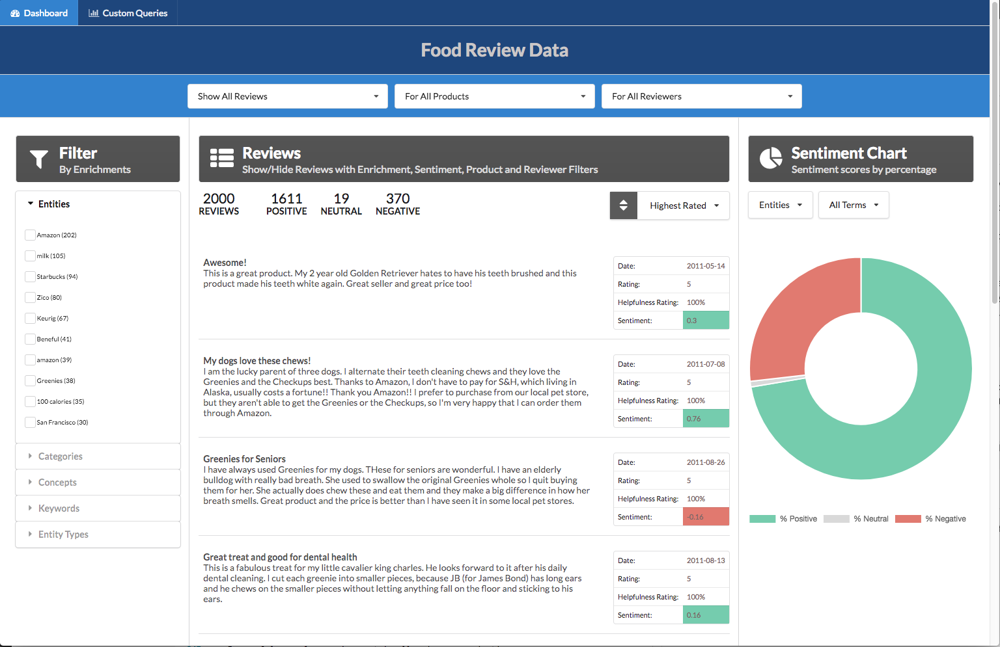

# Discovery collection configuration details

For reference, the following screen-shots detail how to set-up a collection configuration and load data files. In this code pattern, this process is completed for you when the application is initially started, but it is important to know what is happening in the background.

If you were to create the configuration manually, these are the steps you would take:

Launch the **Watson Discovery** tool. Create a new data collection by clicking the **Upload you own data** button. Enter a unique name to create your collection.


From the new collection data panel, click the **Configure Data** button at the top of the panel. Then select the **Enrich fields** tab.

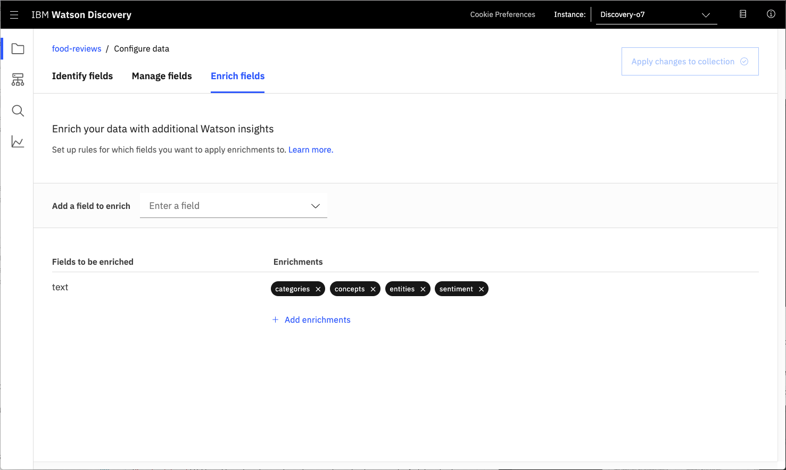

You can see that as a default, there are several enrichments that will be applied to your data collection. But we need to add to this list.

Click on **Add enrichments**.

At the top of the list, select **Keyword Extraction**.

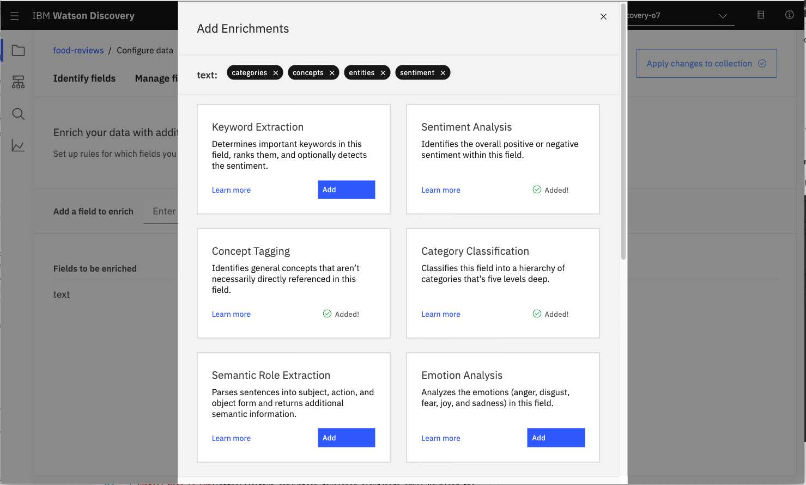

At the bottom of the list, select both **Entity Extraction** and **Relation Extraction**. Enter the **Model ID** that we created in **Watson Knowledge Studio**.

Close the enrichments window.

Click **Apply changes to collection** to start the process of loading the discovery files.

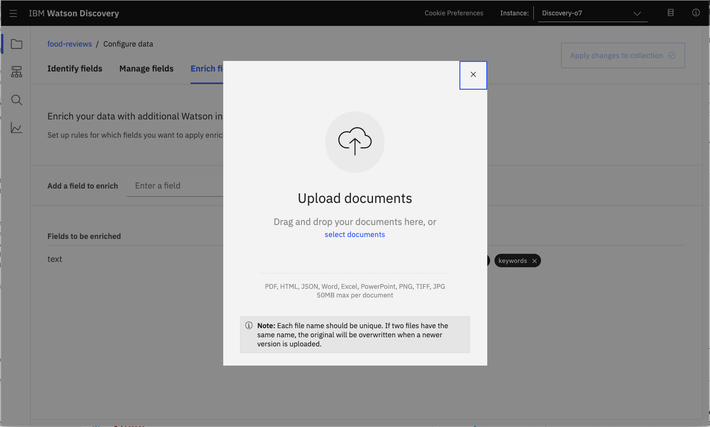

Drag and drop your documents here or browse to your local computer files to load the collection with the json files located in [data/food_reviews](data/food_reviews/).

> NOTE: If using the **Discovery Lite** plan, you are limited to loading up to 1000 files into your discovery service. This limit is not per collection, but the combined number for all collections in your service.

# Troubleshooting

* Error when loading files into Discovery

  > Loading all 1000 document files at one time into Discovery can sometimes lead to "busy" errors. If this occurs, start over and load a small number of files at a time.

* No keywords appear in the app

  > This can be due to not having a proper configuration file assigned to your data collection. See [Step 5](#5-import-corpus-documents) above.

# Links

* [Demo on Youtube](https://www.youtube.com/watch?v=todo): Watch the video
* [Watson Node.js SDK](https://github.com/watson-developer-cloud/node-sdk): Download the Watson Node SDK.
* [Discovery Search UI](https://github.com/IBM/watson-discovery-ui): A sample UI that this repo is based on.
* [Kaggle dataset](https://www.kaggle.com/snap/amazon-fine-food-reviews): A dataset of Amazon reviews.

# Learn more

* **Artificial Intelligence Code Patterns**: Enjoyed this code pattern? Check out our other [AI Code Patterns](https://developer.ibm.com/technologies/artificial-intelligence/).
* **AI and Data Code Pattern Playlist**: Bookmark our [playlist](https://www.youtube.com/playlist?list=PLzUbsvIyrNfknNewObx5N7uGZ5FKH0Fde) with all of our code pattern videos
* **With Watson**: Want to take your Watson app to the next level? Looking to utilize Watson Brand assets? [Join the With Watson program](https://www.ibm.com/watson/with-watson/) to leverage exclusive brand, marketing, and tech resources to amplify and accelerate your Watson embedded commercial solution.

# License

This code pattern is licensed under the Apache Software License, Version 2.  Separate third party code objects invoked within this code pattern are licensed by their respective providers pursuant to their own separate licenses. Contributions are subject to the [Developer Certificate of Origin, Version 1.1 (DCO)](https://developercertificate.org/) and the [Apache Software License, Version 2](https://www.apache.org/licenses/LICENSE-2.0.txt).

[Apache Software License (ASL) FAQ](https://www.apache.org/foundation/license-faq.html#WhatDoesItMEAN)
