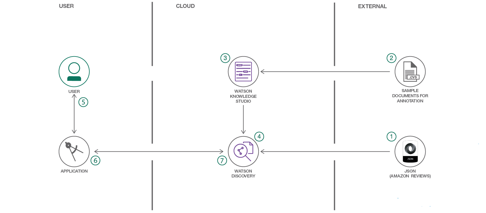
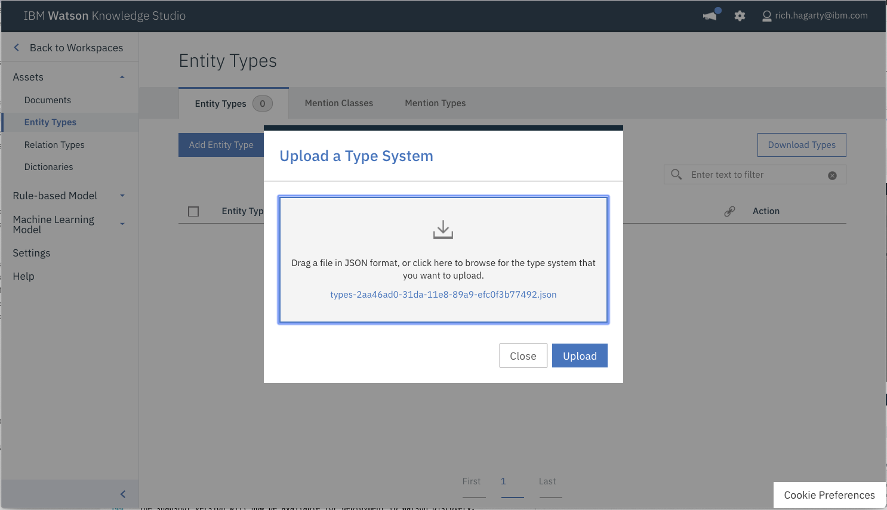

[](https://travis-ci.org/IBM/watson-discovery-food-reviews)

# Discovery customer sentiment from product reviews

In this Code Pattern, we walk you through a working example of a web application that queries and manipulates data from the Watson Discovery Service. With the aid of a custom model built with Watson Knowledge studio,the data will have additional enrichments that will provide improved insights for user analysis.

This web app contains multiple UI components that you can use as a starting point for developing your own Watson Discovery and Knowledge Studio service applications. 

The main benefit of using the Watson Discovery Service is its powerful analytics engine that provides cognitive enrichments and insights into your data. This app provides examples of how to showcase these enrichments through the use of filters, lists and graphs. The key enrichments that we will focus on are:

* **Entities**: people, companies, organizations, cities, and more.
* **Categories**: classification of the data into a hierarchy of categories up to 5 levels deep.
* **Concepts**: identified general concepts that aren't necessarily referenced in the data.
* **Keywords**: important topics typically used to index or search the data.
* **Entity Types**: the classification of the discovered entities, such as person, location, or job title.
* **Sentiment**: the overall positive or negative sentiment of each document.

With Watson Knowledge Studio (WKS), a machine learning annotator can be trained to recognize mentions of custom entity and relation types which can then be incorporated into the Discovery application enrichment process.

> For this Code Pattern, we will be using data that contains food reviews from Amazon, see the [Kaggle dataset](https://www.kaggle.com/snap/amazon-fine-food-reviews) for further information.

When the reader has completed this Code Pattern, they will understand how to:
* Use Watson Knowledge Studio to create a custom annotator.
* Deploy a WKS model to Watson Discovery.
* Load and enrich data in the Watson Discovery Service.
* Query and manipulate data in the Watson Discovery Service.
* Create UI components to represent enriched data created by the Watson Discovery Service.
* Build a complete web app that utilizes popular JavaScript technologies to feature Watson Discovery Service data and enrichments.



## Flow
1. A sample set of review documents are loaded into WKS for annotation.
2. A WKS model is created.
3. The WKS model is applied to a Watson Discovery service instance.
4. The food review json files are added to the Discovery collection.
5. The user interacts with the backend server via the app UI. The frontend app UI uses React to render search results and can reuse all of the views that are used by the backend for server side rendering. The frontend is using semantic-ui-react components and is responsive.
6. User input is processed and routed to the backend server, which is responsible for server side rendering of the views to be displayed on the browser. The backend server is written using express and uses express-react-views engine to render views written using React.
7. The backend server sends user requests to the Watson Discovery Service. It acts as a proxy server, forwarding queries from the frontend to the Watson Discovery Service API while keeping sensitive API keys concealed from the user.

> NOTE: see [DEVELOPING.md](DEVELOPING.md) for project structure.

## Included components
* [Watson Discovery](https://www.ibm.com/watson/developercloud/discovery.html): A cognitive search and content analytics engine for applications to identify patterns, trends, and actionable insights.
* [Watson Knowledge Studio](https://www.ibm.com/watson/services/knowledge-studio/): Teach Watson the language of your domain with custom models that identify entities and relationships unique to your industry, in unstructured text. Use the models in Watson Discovery, Watson Natural Language Understanding, and Watson Explorer.

## Featured technologies
* [Node.js](https://nodejs.org/): An open-source JavaScript run-time environment for executing server-side JavaScript code.
* [React](https://facebook.github.io/react/): A JavaScript library for building User Interfaces.
* [Express](https://expressjs.com): A popular and minimalistic web framework for creating an API and Web server.
* [Semantic UI React](https://react.semantic-ui.com/introduction): React integration of Semantic UI components. 
* [Chart.js](http://www.chartjs.org/): JavaScript charting package.
* [Jest](https://facebook.github.io/jest/): A JavaScript test framework.

# Steps

> NOTE: Due to the requirement that the Watson Discovery service has to be configured to run with a specific WKS model, this Code Pattern must be installed locally. 

1. [Clone the repo](#1-clone-the-repo)
2. [Create IBM Cloud services](#2-create-ibm-cloud-services)
3. [Create a Watson Knowledge Studio workspace](#3-create-a-watson-knowledge-studio-workspace)
4. [Upload Type System](#4-upload-type-system)
5. [Import Corpus Documents](#5-import-corpus-documents)
6. [Create the model](#6-create-the-model)
7. [Deploy the machine learning model to Watson Discovery](#7-deploy-the-machine-learning-model-to-watson-discovery)
8. [Create Discovery Collection and Configuration](#8-create-discovery-collection-and-configuration)
9. [Load the Discovery files](#9-load-the-discovery-files)
10. [Configure credentials](#10-configure-credentials)
11. [Run the application](#11-run-the-application)
12. [Deploy and run the application on IBM Cloud](#12-deploy-and-run-the-application-on-ibm-cloud)

## 1. Clone the repo
```
$ git clone https://github.com/IBM/watson-discovery-food-reviews
```

## 2. Create IBM Cloud services

Create the following services:

* [**Watson Discovery**](https://console.ng.bluemix.net/catalog/services/discovery)
* [**Watson Knowledge Studio**](https://console.bluemix.net/catalog/services/knowledge-studio)

## 3. Create a Watson Knowledge Studio workspace

Launch the **WKS** tool and create a new **workspace**.


## 4. Upload Type System

A type system allows us to define things that are specific to review documents, such as product and brand names. The type system controls how content can be annotated by defining the types of entities that can be labeled and how relationships among different entities can be labeled.

To upload our pre-defined type system, from the `Access & Tools` -> `Entity Types` panel, press the `Upload` button to import the Type System file [data/types-2aa46ad0-31da-11e8-89a9-efc0f3b77492.json](data/types-2aa46ad0-31da-11e8-89a9-efc0f3b77492.json) found in the local repository.



This will upload a set of Entity Types and Relation Types.


## 5. Import Corpus Documents

Corpus documents are required to train our machine-learning annotator component. For this Code Pattern, the corpus documents will contain sample review documents.

From the `Access & Tools` -> `Documents` panel, press the `Upload Document` Sets button to import a Document Set file. Use the corpus documents file `data/watson-discovery-food-reviews/data/corpus-2aa46ad0-31da-11e8-89a9-efc0f3b77492.zip` found in the local repository.

> NOTE: Select the option to "upload corpus documents and include ground truth (upload the original workspace's type system first)"


## 6. Create the model

Since the corpus documents that were uploaded were already pre-annotated and included ground truth, it is possible to build the machine learning annotator directly without the need for performing human annotations.

Go to the `Model Management` -> `Performance` panel, and press the `Train and evaluate` button.


From the **Document Set** name list, select the annotation sets `Docs28.csv` and `Docs122V2.csv`. Also, make sure that the option `Run on existing training, test and blind sets` is checked.  Press the `Train & Evaluate` button.

This process may take several minutes to complete. Progress will be shown in the upper right corner of the panel.

Once complete, you will see the results of the train and evaluate process.

You can view the log files of the process by clicking the `View Log` button.

## 7. Deploy the machine learning model to Watson Discovery

Now we can deploy our new model to the already created **Watson Discovery** service. Navigate to the `Version` menu on the left and press `Take Snapshot`.


The snapshot version will now be available for deployment to Watson Discovery.


To start the process, click the `Deploy` button associated with your snapshot version.

Select the option to deploy to **Discovery**.


Then enter your IBM Cloud account information to locate your **Discovery** service to deploy to.


Once deployed, a **Model ID** will be created. Keep note of this value as it will be required later in this Code Pattern.


> NOTE: You can also view this **Model ID** by clicking the WDS link under 'Status'  against the deployed version.

## 8. Create Discovery Collection and Configuration

Launch the **Watson Discovery** tool. Create a **new data collection**
and give the data collection a unique name.


From the new collection data panel, under `Configuration` click the `Switch` button to switch to a new configuration file. Click `Create a new configuration` option.


Enter a unique name and press `Create`.

From the **Configuration Panel**, press the `Add enrichments` option. Ensure that the following **extraction** options are added: **Keyword**, **Entity**, and **Relation**.

Also, assign your **Model ID** to both the **Entity Extraction** and **Relation Extraction**.

> Note: These **Model ID** assignments are required to ensure your review data is properly enriched.


Close the **Add Ennrichments** panel by pressing `Done`.

Save the configuration by pressing `Apply & Save`, and then `Close`.

## 9. Load the Discovery files

From the new collection data panel, under `Add data to this collection` use `Drag and drop your documents here or browse from computer` to seed the content with the 2000 json files extracted from `data/food_reviews/`.

> Note: If you don't load files, they will be automatically added when you run `npm start`.


> Save the **environment_id** and **collection_id** for your `.env` file in the next step. You can find this data by clicking on `Use this collection API` under the **Collection Info** header located at the top right portion of the panel.

## 10. Configure credentials
```
cp env.sample .env
```
Edit the `.env` file with the necessary settings.

#### `env.sample:`

```
# Replace the credentials here with your own.
# Rename this file to .env before starting the app.

# Watson Discovery
DISCOVERY_USERNAME=<add_discovery_username>
DISCOVERY_PASSWORD=<add_discovery_password>
DISCOVERY_ENVIRONMENT_ID=<add_discovery_environment>
DISCOVERY_COLLECTION_ID=<add_discovery_collection>

# Run locally on a non-default port (default is 3000)
# PORT=3000

```

## 11. Run the application

1. Install [Node.js](https://nodejs.org/en/) runtime or NPM.
1. Start the app by running `npm install`, followed by `npm start`.
1. Access the UI by pointing your browser at `localhost:3000`.
> Note: `PORT` can be configured in `.env`.

## 12. Deploy and run the application on IBM Cloud

To deploy to the IBM Cloud, make sure have the [IBM Cloud CLI](https://console.bluemix.net/docs/cli/reference/bluemix_cli/get_started.html#getting-started) tool installed. Then run the following commands to login using your IBM Cloud credentials.

```
$ cd watson-discovery-food-reviews
$ cf login
```

When pushing your app to the IBM Cloud, values are read in from the [manifest.yml](manifest.yml) file. Edit this file if you need to change any of the default settings, such as application name or the amount of memory to allocate.

```
---
applications:
- path: .
  name: watson-discovery-food-reviews
  buildpack: sdk-for-nodejs
  memory: 640M
  instances: 1
  ```

To deploy your application, run the following command. Note that we don't want the app to start initially, as we need to assign some environment variables first.

```
$ cf push --no-start
```

> NOTE: The URL route assigned to your application will be displayed as a result of this command. Note this value, as it will be required to access your app.

Set the environment variables to access your **Discovery** service. Substitute in your application name, and your **Discovery** service environment and collection credentials.

```
$ cf set-env <app name> DISCOVERY_USERNAME '<add_discovery_username>'
$ cf set-env <app name> DISCOVERY_PASSWORD '<add_discovery_password>'
$ cf set-env <app name> DISCOVERY_ENVIRONMENT_ID '<add_discovery_environment>'
$ cf set-env <app name> DISCOVERY_COLLECTION_ID '<add_discovery_collection>'

# to verify your entries, run the following command:
$ cf env <app name>
```

Start the application.

```
$ cf start <app name>
```

To view the application, go to the IBM Cloud route assigned to your app. Typically, this will take the form `https://<app name>.mybluemix.net`.

To view logs, or get overview information about your app, use the IBM Cloud dashboard.

# Sample UI layout


# Troubleshooting

* Error when loading files into Discovery

  > Loading all 2000 document files at one time into Discovery can sometimes lead to "busy" errors. If this occurs, start over and load a small number of files at a time.

* No keywords appear in the app

  > This can be due to not having a proper configuration file assigned to your data collection. See [Step 3](#3-load-the-discovery-files) above.

# Links

* [Demo on Youtube](https://www.youtube.com/watch?v=todo): Watch the video
* [Watson Node.js SDK](https://github.com/watson-developer-cloud/node-sdk): Download the Watson Node SDK.

# Learn more

* **Artificial Intelligence Code Patterns**: Enjoyed this Code Pattern? Check out our other [AI Code Patterns](https://developer.ibm.com/code/technologies/artificial-intelligence/).
* **AI and Data Code Pattern Playlist**: Bookmark our [playlist](https://www.youtube.com/playlist?list=PLzUbsvIyrNfknNewObx5N7uGZ5FKH0Fde) with all of our Code Pattern videos
* **With Watson**: Want to take your Watson app to the next level? Looking to utilize Watson Brand assets? [Join the With Watson program](https://www.ibm.com/watson/with-watson/) to leverage exclusive brand, marketing, and tech resources to amplify and accelerate your Watson embedded commercial solution.

# License
[Apache 2.0](LICENSE)
